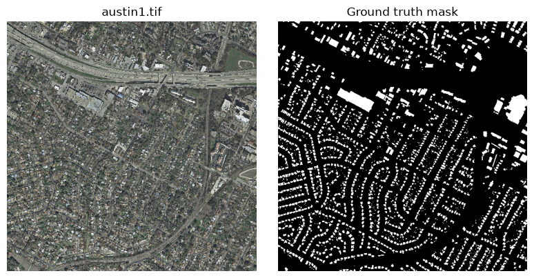
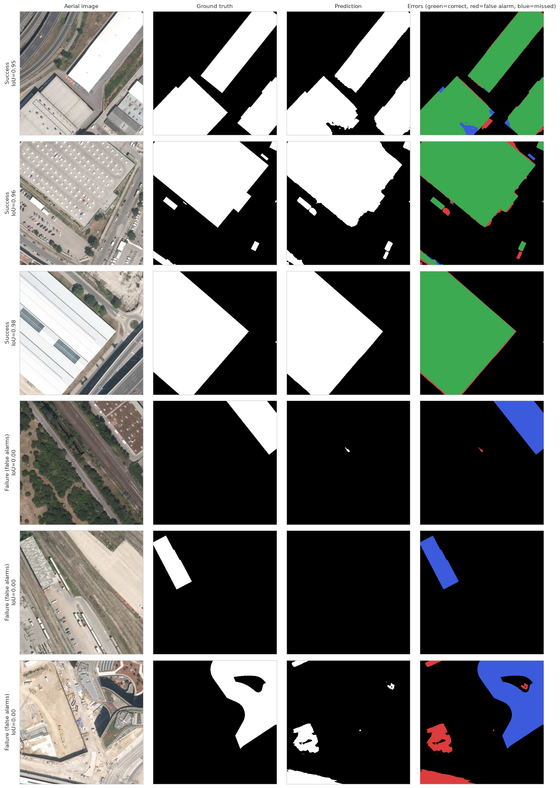

# Building Footprint Segmentation — Inria Aerial Image Labeling

Binary semantic segmentation (building vs. background) on 0.3m-resolution aerial imagery, using a
U-Net with a ResNet34 encoder. Built for the
[Inria Aerial Image Labeling contest](https://project.inria.fr/aerialimagelabeling/) — pixel-level
building footprints across 10 cities on two continents, with no labels released for the test cities.


*One 5000×5000 training tile and its corresponding building mask (255 = building, 0 = background).*


*Green = correct, red = false alarm, blue = missed building. Successes reach block IoU 0.95–0.98 on
large, geometrically distinct structures; failures cluster on low-contrast buildings (flat rooftops
blending into surrounding pavement) and are dominated by missed detections rather than false alarms.
Note: this grid is from an earlier 3-city-holdout version of the model (same architecture and loss,
trained on Austin/Chicago/Kitsap only); the pretrained weights linked below are from the current
5-region training run used for the actual contest submission.*

## Highlights

- **180 labeled 5000×5000 tiles** across 5 regions (Austin, Chicago, Kitsap, Western Tyrol, Vienna) —
  train/val split follows Inria's own suggested scheme: tiles 1–5 of every region held out for
  validation, the remaining 155 for training.
- `rasterio` **windowed reads** — only the 512×512 patch actually needed is pulled off disk, so the
  ~20GB dataset is never loaded into memory as full tiles.
- **Hybrid loss**: BCE + Dice (buildings are only ~14.5% of pixels — plain BCE would collapse toward
  predicting background everywhere) plus a morphological edge-weighting term that up-weights boundary
  pixels for sharper building outlines.
- **Sliding-window inference** with overlapping windows averaged together, so tile seams and patch
  boundaries don't leave visible artifacts in the predicted mask.

## Results (validation split)

| Metric | Score |
|---|---|
| IoU | 0.677 |
| Dice / F1 | 0.808 |
| Precision | 0.809 |
| Recall | 0.806 |

Pixel accuracy is deliberately **not** used for model selection: an all-background predictor scores
~85.5% on this dataset while detecting zero real buildings, which is exactly why this project reports
IoU/Dice/precision/recall instead.

## Why the model generalizes (not just fits)

- Training only ever samples 512×512 patches at random positions inside a tile — patches never
  straddle a train/val split, and no patch overlaps another.
- Validation tiles are 5 *entire* tiles per region held out before any patch is cut, so validation
  performance reflects unseen imagery, not unseen crops of the same imagery.
- Pixel counts (TP/FP/FN/TN) are accumulated across the *entire* validation set before computing IoU
  etc. — a tile with almost no buildings doesn't get the same weight as a tile full of them.

## Contest submission

Predictions on Inria's official (unlabeled) test tiles — Bellingham, Bloomington, Innsbruck,
San Francisco, Eastern Tyrol — are exported as 0/255 single-band GeoTIFFs matching the input
filenames, CCITT Group 4-compressed (~46MB for all 180 tiles vs. 4.5GB uncompressed), and zipped for
submission. See the notebook's final cells for the export/compression pipeline.

## Pretrained weights

The trained checkpoint (`best_model.pth`, ~98MB, from the 5-region training run) isn't committed to
this repo — it's just under GitHub's 100MB file limit but too large to track sensibly in normal git
history. Download it from the **[Releases](../../releases)** page instead of the repo tree.

## Repo structure

```
.
├── building_segmentation.ipynb   # full pipeline: data check → split → train → validate → submit
├── images/                       # visuals referenced in this README
├── requirements.txt
└── .gitignore
```

## Running it

```bash
pip install -r requirements.txt
jupyter notebook building_segmentation.ipynb
```

Requires a CUDA GPU for a full training run (~110 min on an RTX A6000, 28 epochs to convergence); a
`QUICK_RUN` flag in the settings cell runs a small CPU-friendly sanity check instead.

Dataset: [Inria Aerial Image Labeling Dataset](https://project.inria.fr/aerialimagelabeling/)
(Maggiori et al., 2017).

## Limitations / next steps

- The ResNet34 encoder is ImageNet-pretrained — natural-image features transfer well but don't fully
  capture aerial-specific texture and scale.
- Buildings with low contrast against surrounding pavement/terrain (flat rooftops blending into
  parking lots, for instance) are the model's main failure mode — recall drops specifically on these,
  not precision, suggesting the model is cautious rather than trigger-happy.
- Contest leaderboard score (on the true held-out test cities) not yet included here — validation
  numbers above are on the internal split, which is a reasonable proxy but not the official metric.

---
Muminul Hoque · [GitHub](https://github.com/Muminul-Hoque)
